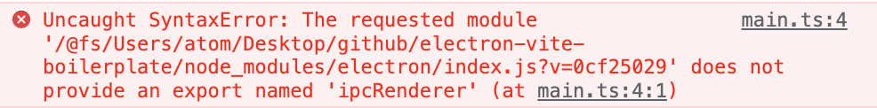
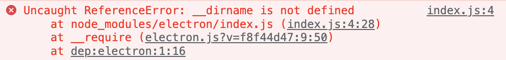

## 渲染进程使用 Node.js

首先，你需要确保你的主进程开启了 `nodeIntegration: true`。

#### 使用 require


下面我们以 `electron` `fs` 模块为例，尝试在渲染进程中使用 `require()` 函数加载它们。

```js
// packages/renderer/src/main.ts

const { ipcRenderer } = require('electron')
const fs = require('fs')

console.log(ipcRenderer) // ▶ EventEmitter
console.log(fs) // ▶ Object
```

在 `vite serve` 阶段 `electron` 模块使用 `require()` 函数可以正常工作！因为当 Vite 碰到 `require()` 函数并不会认为它是 CommonJs 模块规范的 `require()` 函数，而是看做普普通通的 JavaScript 函数，也不会有任何的处理。这时自然能在渲染进程下正常使用。

#### 使用 import

`require()` 不好的地方就是它并不是 EcmaScript 官方的标准，况在 VSCode 这类编辑器下没有好的代码提示支持！接下来我们尝试下换成 ESModule 方式加载它们模块看看会发生什么。

```js
// packages/renderer/src/main.ts

import { ipcRenderer } from 'electron'
import fs from 'fs'

console.log(ipcRenderer)
console.log(fs)
```

运行得到如下错误

<!-- path.join.png -->
```log
Uncaught TypeError: path.join is not a function
    at node_modules/electron/index.js (index.js:4:23)
    at __require (electron.js?v=1d44ed29:9:50)
    at dep:electron:1:16
```

顺着报错我们用鼠标点击去查看

<!-- electron-path.png -->
```js
const fs = require('fs');
const path = require('path');

const pathFile = path.join(__dirname, 'path.txt');
                      ^^^^^^^^^^^^^^^^^^^^^^^^^^^^

function getElectronPath () {
  let executablePath;
  if (fs.existsSync(pathFile)) {
    executablePath = fs.readFileSync(pathFile, 'utf-8');
  }
  if (process.env.ELECTRON_OVERRIDE_DIST_PATH) {
    return path.join(process.env.ELECTRON_OVERRIDE_DIST_PATH, executablePath || 'electron');
  }
  if (executablePath) {
    return path.join(__dirname, 'dist', executablePath);
  } else {
    throw new Error('Electron failed to install correctly, please delete node_modules/electron and try installing again');
  }
}

module.exports = getElectronPath();
```

看上去不禁让人有些许费解，这里的 `const path = require('path');` 理应可以正常工作的，毕竟前面我们试过 `require('fs')` 可以正常使用。其实这是 sourcemap 映射出来的源码，并非运行时的真实代码。

其次 `electron` 属于 Electron 的内置模块。但 Vite 并不这么认为；还循规蹈矩的把 `node_modules/electron/index.js` 给翻出来了 :D

#### 查看预构建

我们知道 Vite 在 `vite serve` 阶段任何使用 `import` 导入“裸模块(即node_modules中模块)”都会被 [预构建](https://vitejs.dev/guide/dep-pre-bundling.html#dependency-pre-bundling) 以 ESM 格式构建到 `node_modules/.vite` 下，顺着这个思路我们不妨看下 `electron` 构建后的产物。

```js
// node_modules/.vite/deps/electron.js

// browser-external:path
var path_exports = {};
__export(path_exports, {
  default: () => path_default
});
var path_default;
var init_path = __esm({
  "browser-external:path"() {
    path_default = new Proxy({}, {
      get() {
        throw new Error('Module "path" has been externalized for browser compatibility and cannot be accessed in client code.');
      }
    });
  }
});

// node_modules/electron/index.js
var require_electron = __commonJS({
  "node_modules/electron/index.js"(exports, module) {
    // ...
    var path = (init_path(), __toCommonJS(path_exports));
    // ...
  }
});
```

代码有点多，我们这里只粘贴一部分说明问题即可。这里有个明显的问题 Vite(v2.9.9) 将 `path` 当成了 `browser-external:path` 模块，还对其进行了 polyfill；已经不再是 Node.js 内置的那个 path 模块了。

#### 避开 Vite 预构建

一般来说，Vite 无法正常构建 Node.js 内置模块 `electron` `fs` `path` 等等。或者说任何一个打包器包括但不限于 Webpack、Rollup、esbuild 等等。如果碰到 Node.js 内置模块，各种打包器的处理方式都是将其作为 “外置模块” 处理，也即 `external`。

```js
// packages/renderer/src/vite.config.ts

export default {
  optimizeDeps: {
    // 告诉 Vite 不要预构建 electron。至于 fs、path 这类 Node.js 内置模块 Vite 内部会自动判断
    exclude: ['electron'],
  },
}
```

再次运行我们再看看 Vite 都干了哪些“好事”, 打开控制台的 Network 看看真实 GET 到的代码。

> 控制台 -> Network

<!-- vite-serve-main1.png -->
```js
// Network:/src/main.ts

import { ipcRenderer } from "/@fs/Users/atom/Desktop/github/electron-vite-boilerplate/node_modules/electron/index.js?v=2bd743f2";
import fs from "/@id/__vite-browser-external:fs";
console.log(ipcRenderer);
console.log(fs);
```

<!-- vite-serve-electron1.png -->
```js
// Network:/@fs/Users/atom/Desktop/github/electron-vite-boilerplate/node_modules/electron/index.js?v=2bd743f2

const fs = require('fs');
const path = require('path');

const pathFile = path.join(__dirname, 'path.txt');

function getElectronPath () {
  let executablePath;
  if (fs.existsSync(pathFile)) {
    executablePath = fs.readFileSync(pathFile, 'utf-8');
  }
  if (process.env.ELECTRON_OVERRIDE_DIST_PATH) {
    return path.join(process.env.ELECTRON_OVERRIDE_DIST_PATH, executablePath || 'electron');
  }
  if (executablePath) {
    return path.join(__dirname, 'dist', executablePath);
  } else {
    throw new Error('Electron failed to install correctly, please delete node_modules/electron and try installing again');
  }
}

module.exports = getElectronPath();
```

<!-- vite-serve-fs1.png -->
```js
// Network:/@id/__vite-browser-external:fs

export default new Proxy({}, {
  get() {
    throw new Error('Module "fs" has been externalized for browser compatibility and cannot be accessed in client code.')
  }
})
```

1. `electron` 返回了 `node_modules/elecctron/index.js` 这个路径文件，不是我们想要的。
2. `fs` 返回了 Vite 的 polyfill 代码，不是我们想要的。

不出意外控制台报错了

<!--  -->

```log
Uncaught SyntaxError: The requested module '/@fs/Users/atom/Desktop/github/electron-vite-boilerplate/node_modules/electron/index.js?v=8ab51fed' does not provide an export named 'ipcRenderer' (at main.ts:1:1)
```

至此，看起来 Vite 好像没有什么配置给我们使用了，或者我们 没法通过配置的方式告诉 Vite 如何正确的构建它们。

#### import 与 require 协同

回到最开始，我们使用了 `require()` 能够使得内置模块正常工作。由于 `import` 背后有 Vite 的处理反而给我们带来了许多的麻烦，那么我们能不能让 Vite 对待 `import` 也具有 `require()` 的行为呢？那样的话就能统筹兼顾两者的好处了。

比如有码如下：

```js
// 设想流程

import { ipcRenderer } from 'electron'
// ↓
// 浏览器发起 electron 模块请求到 Vite
// ↓
// 在 Vite 中拦截到 electron 请求
// ↓
// 返回 require() 函数形式的代码段
// ↓
// const { ipcRenderer } = require('electron')
// export { ipcRenderer }
console.log(ipcRenderer) // ▶ EventEmitter
```

#### Vite 插件入门 (虚拟模块)

拦截 Vite 的处理，必然得涉及到写一个 Plugin 完成我们的需求；官方有个很小又很具有代表性的案例 [Virtual Modules Convention](https://vitejs.dev/guide/api-plugin.html#virtual-modules-convention)。借助这个案例实现下我们插件的设计。

```js
export default function myPlugin() {
  // 虚拟模块 electron - 对应 import { ipcRenderer } from 'electron' 语句导入的 electron
  const virtualModuleId = 'electron'
  // \0 前缀是 Rollup 插件的约定，告诉 Vite 内部不要处理
  const resolvedVirtualModuleId = '\0' + virtualModuleId

  return {
    name: 'vite-plugin-electron-renderer',
    // 注意：这里有别于官方的提供的 Demo
    // 强制插件靠前运行，不然 electron 会提前被 Vite 内置的 vite:resolve 插件拦截
    enforce: 'pre',
    resolveId(id) {
      if (id === virtualModuleId) {
        // 返回带有 \0 前缀的 electron 模块名称，告诉 Vite 不要处理这个模块
        return resolvedVirtualModuleId
      }
    },
    load(id) {
      if (id === resolvedVirtualModuleId) {
        // 返回能够在渲染进程中正常工作的 require() 代码段
        return `const { ipcRenderer } = require('electron'); export { ipcRenderer }`
      }
    }
  }
}
```

插件工作流程图：

```
┏————————————————————————————————————————┓                    ┏—————————————————┓
│ import { ipcRenderer } from 'electron' │                    │ Vite dev server │
┗————————————————————————————————————————┛                    ┗—————————————————┛
                   │                                                   │
                   │ 1. HTTP(Request): electron module                 │
                   │ ————————————————————————————————————————————————> │
                   │                                                   │
                   │                                                   │
                   │ 2. Intercept in load-hook(Plugin)                 │
                   │ 3. Generate a virtual module(electron)            │
                   │    ↓                                              │
                   │    const { ipcRenderer } = require('electron')    │
                   │    export { ipcRenderer }                         │
                   │                                                   │
                   │                                                   │
                   │ 4. HTTP(Response): electron module                │
                   │ <———————————————————————————————————————————————— │
                   │                                                   │
┏————————————————————————————————————————┓                    ┏—————————————————┓
│ import { ipcRenderer } from 'electron' │                    │ Vite dev server │
┗————————————————————————————————————————┛                    ┗—————————————————┛
```

#### 使用 electron-renderer 插件

```js
// packages/renderer/src/vite.config.ts

export default {
  plugins: [
    // 启用插件
    myPlugin(),
  ],
  optimizeDeps: {
    // 告诉 Vite 不要预构建 electron。至于 fs、path 这类 Node.js 内置模块 Vite 内部会自动判断
    exclude: ['electron'],
  },
}
```

源码

```js
import { ipcRenderer } from 'electron'
console.log(ipcRenderer) // ▶ EventEmitter
```

转换后

<!-- vite-serve-main2.png -->
```js
// Network:/src/main.ts

import { ipcRenderer } from "/@id/__x00__electron";
console.log(ipcRenderer);
```

<!-- vite-serve-electron2.png -->
```js
// Network:/@id/__x00__electron

const { ipcRenderer } = require('electron'); export { ipcRenderer }
```

控制台输出

<!-- log-ipcRenderer2.png -->
```log
▶ EventEmitter {_events: {…}, _eventsCount: 0, _maxListeners: undefined, send: ƒ, sendSync: ƒ, …}
```

**🎉 Good job!**

综上，我们已经掌握了在渲染进程中使用 `electron` 和 Node.js 内置模块的要领。

---

*早期版本(v2.8)还会出现下面的错误，错误原因都是 Vite 错误的加载了 `node_modules/elecctron/index.js` 这个路径文件的问题。*
<!--  -->

```log
Uncaught ReferenceError: __dirname is not defined
    at node_modules/electron/index.js (index.js:4:28)
    at __require (electron.js?v=1d44ed29:9:50)
    at dep:electron:1:16
```
