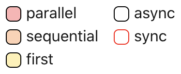

## Vite Plugin 入门

为什么会有 Vite Plugin 部分？坦白的说，一些复杂的功能只通过 Vite 的 Config 是无法完成的。这时候我们需要学会开发 Plugin 完成我们的需求。

本章不会介绍太复杂的 Plugin 知识，也不会带你写出什么很高大上的的 Plugin。单纯为了我们后面讲解的内容做铺垫。

官方的话说 **“推荐在阅读下面的章节之前，首先阅读下 [Rollup 插件文档](https://rollupjs.org/guide/en/#plugin-development)”**。


<br>


好吧，我承认我英语不好。可能官方推荐的方式我无法愉快的入门~ 看着很头大！

总的来看，所谓 Plugin 本质就是一些 “插件钩子” 组成的。需要注意的是 Vite 和 Rollup 插件还是有些许区别的，主要可以理解为 Vite 在 Rollup 的基础上增加了几个 [Vite 独有钩子](https://cn.vitejs.dev/guide/api-plugin.html#vite-specific-hooks)。

在此索性根据自己写插件的经验，简单的总结了如下几点。可能会帮(误)到(导)你，请放(谨)心(慎)食用！

#### 全局插件 vs 运行时插件

1. 全局插件可以理解为只在 Vite 启动时运行一次，例如：

- [config](https://cn.vitejs.dev/guide/api-plugin.html#config)

全局插件主要用于修改、读取配置。

2. 运行时插件可以理解为在 Vite 每转换一个文件时都会运行，例如：

- [resolveId](https://rollupjs.org/guide/en/#resolveid)
- [load](https://rollupjs.org/guide/en/#load)
- [transform](https://rollupjs.org/guide/en/#transform)

运行时插件主要用于拦截导入模块、转换代码。

#### 写个最简单的插件

比如有此需求：

1. 要求 `import` 导入模块使用 CDN 链接。
2. 转换 `process.env.NODE_ENV`。

```js
// 这里导入 vue 模块需要使用全局的 CDN 链接，而不是 npm 安装的 vue 模块
// 通过 CDN 引入的 vue.js 会在 window 挂载一个 Vue 属性
// 我们需要实现一个插件，使 import 语句能正确的导入 CDN 链接引入的 window.Vue
import { createApp } from 'vue'
import App from './App.vue'

// 将 process.env.NODE_ENV 转换成实际的字符串，如 development
console.log(process.env.NODE_ENV)

createApp(App).mount('#app')
```

一个插件即是一个普通的 js 对象，里面放了一些为了实现功能钩子函数。

```js
const myPlugin = {
  name: '插件名称', // 当插件运行错误时候会输出插件名称，方便排查
  enforce: 'pre', // 为了避开 Vite 内置的 vite:resolve 插件，以保障 resolveId 能够被执行
  config(_config) {
    // 只运行一次
    // 可以在这里读取、改动 _config
  },
  resolveId(source) {
    // 每转换一个文件都会执行一次
    // 注意，如果该插件之前的插件也有 resolveId 钩子，且运行后返回了结果；那么这个钩子就不会被调用了！

    if (source === 'vue') {
      // \0 前缀是 Rollup 插件的约定，告诉 Vite 内部不要处理
      return '\0' + 'vue'
    }
  },
  load(id) {
    // 每转换一个文件都会执行一次
    // 注意，如果该插件之前的插件也有 resolveId 钩子，且运行后返回了结果；那么这个钩子就不会被调用了！

    if (id === '\0' + 'vue') {
      // 实现读取 CDN 引入的 window.Vue
      // 返回一个代码段，即 Vite/Rollup 虚拟模块
      return `const createApp = window.Vue.createApp; export { createApp }`
    }
  },
  transform(code) {
    // 每转换一个文件都会执行一次

    // 实现 process.env.NODE_ENV 替换
    return code.replace('process.env.NODE_ENV', `"development"`)
  },
}
```

使用插件

```js
// vite.config.js

export default {
  plugins: [
    // 使用插件 - 看起来如此的简单
    myPlugin,
  ],
}
```
